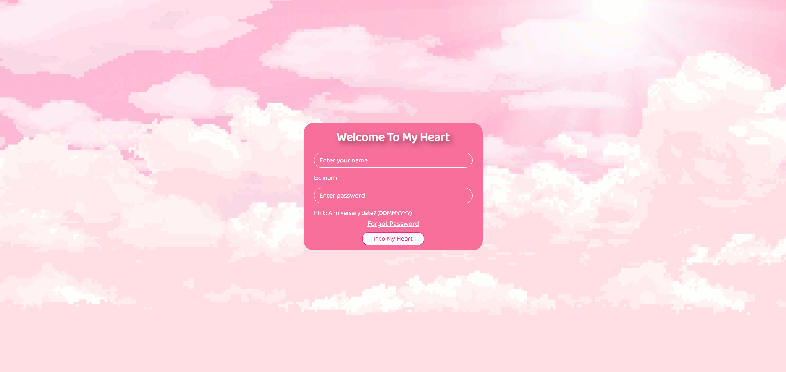

# 🎀 Cute Pink Website

A super simple, single-page website with a soft pink aesthetic 💖  
Created with basic HTML and CSS — perfect for beginners or anyone who loves cute design!

👉 **Live demo:** [mumi-mumeow.github.io/cute-pink-website](https://mumi-mumeow.github.io/cute-pink-website/)

## 🖼️ Preview



---

## ✨ Features

- 🌸 Soft pink background and aesthetic layout
- 🧼 Clean and minimal HTML/CSS
- 🌱 Great starting point for customizing your own cute website

---

## 🚀 How to Use

You can:
- Clone this repository and open `index.html` in any browser
- Or use it as a template for your own project

```bash
git clone https://github.com/mumi-mumeow/cute-pink-website.git
cd cute-pink-website
open index.html
